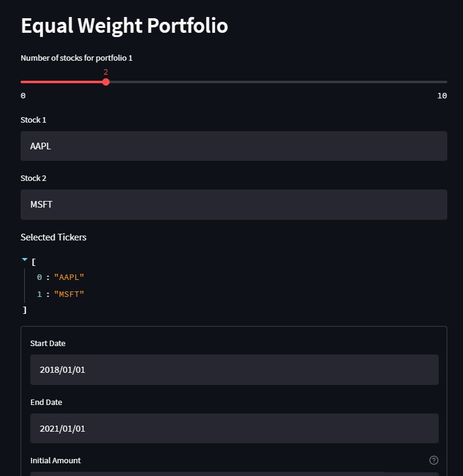
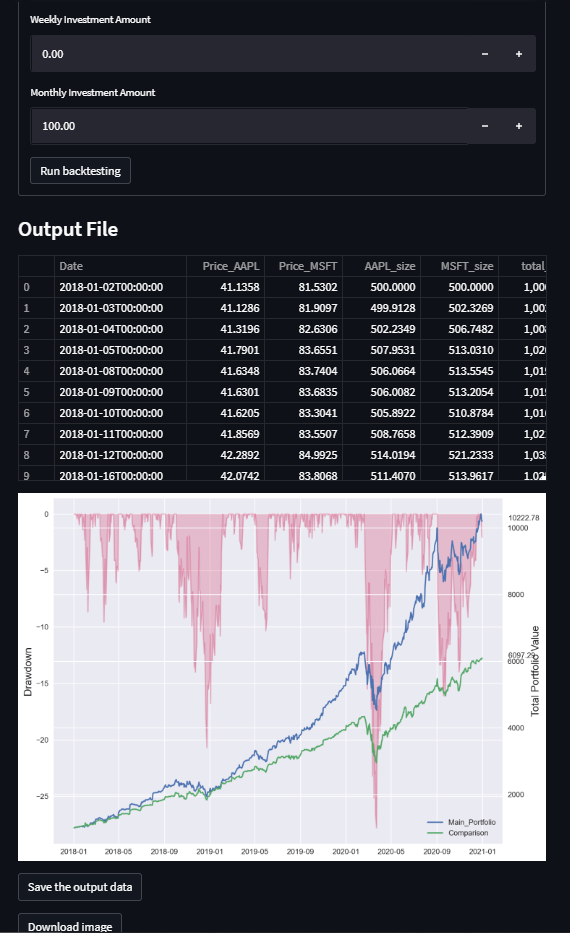

# Equal_Weight_Portfolio_Backtester
## OBJECTIVE 
A Web Application built by streamlit package which rebalances daily the weights of stocks, commodities, FX, ETFs etc. Then calculates return and maximum drawdown and plots them while comparing to a base portfolio. You can see examples of plot and output csv files under the names "comparison_plot.png" and "portfolio_allocation.csv". Also has the options for weekly and monthly investments, reinvest a certain amount when the portfolio loses some percentage etc. You can see screenshots of the web application

## PHOTOS
### Photo_1 

  
### Photo_2 

## INTRO 
If there is no input.xlsx file in the directory of portfolio.exe, run it once and it will create input excel file. 
Whenever portfolio.py runs without error it will make a beep sound (on Windows) and will create comparison_plot image file and portfolio_allocation.csv file. 
If portfolio.py doesn’t working, just remove input.xlsx and run portfolio.py once to make it recreate input.xlsx. Then run again and it will work smoothly. 

## INPUT PARAMETERS 
**Stock list:** the name of the stocks, etfs etc. you want to include in your portfolio. 
**Comparison list:** the name of the stocks, etfs etc. you want to compare your portfolio. 
**Start date:** start date of backtesting 
**Stop date:** stop date of backtesting 
**Initial amount:** initial amount of portfolio 
**Reinvestment option:** It can be ‘percentage’ or ‘constant’. If it is set as ‘percentage’ whenever total portfolio falls below reinvestment threshold, it will reinvest lost amount. If it is set as ‘constant’, it will reinvest a constant amount which is set by ‘reinvestment amount’. 
**Reinvestment threshold:** percentage threshold for reinvestment amount. Whenever total portfolio value loses that much percentage, the script will reinvest by the method selected in ‘reinvestment option’. 
**Reinvestment amount:** if you set ‘reinvestment option’ as ‘constant’, whenever portfolio falls below threshold percentage, the script will reinvest that constant amount. If ‘reinvestment option’’ is set as ‘percentage’, this amount will have no effect. 
Below initial percentage: Whenever, you are reinvesting with constant amount, it will increase that constant amount by ‘below initial percentage’ percent for each loss below initial amount. 
**Weekly amount:** weekly periodic constant investment amount 
**Monthly amount:** monthly periodic constant investment amount 

## OUTPUT COLUMNS 
**Date:** date 
**Price_X:** price of the X stock 
**X_size:** USD amount of X stock in the portfolio 
**Total_value:** total value of the portfolio 
**Periodic_reinvestment:** weekly or monthly periodic investments 
**Reinvestment_due_to_loss:** Amount of reinvestment whenever loss exceeds the threshold 
**X_change:** Amount of change made in the X stock by the script. If it is positive, then the script has bought the stock, if it is negative, then the script has sold the stock. 
**Total_value_percentage:** total value of the portfolio in percentages compared to initial amount 
**Drawdown:** Maximum drawdown of the portfolio 

